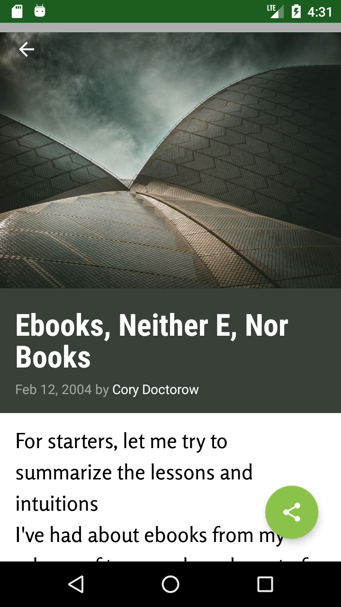

# XYZ Reader

In this project, task is to redesign an app to follow the Material Design guidelines and translate a set of static design mocks to a living and breathing app.
XYZ Reader: A mock RSS feed reader featuring banner photos and headlines.

Screenshots

<image src="Screenshot_1513854055.png" height="400px"/> &nbsp;&nbsp;
 
